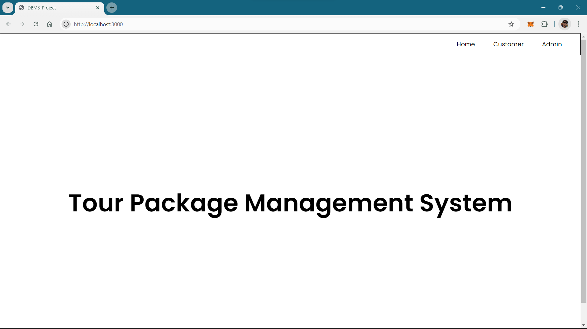
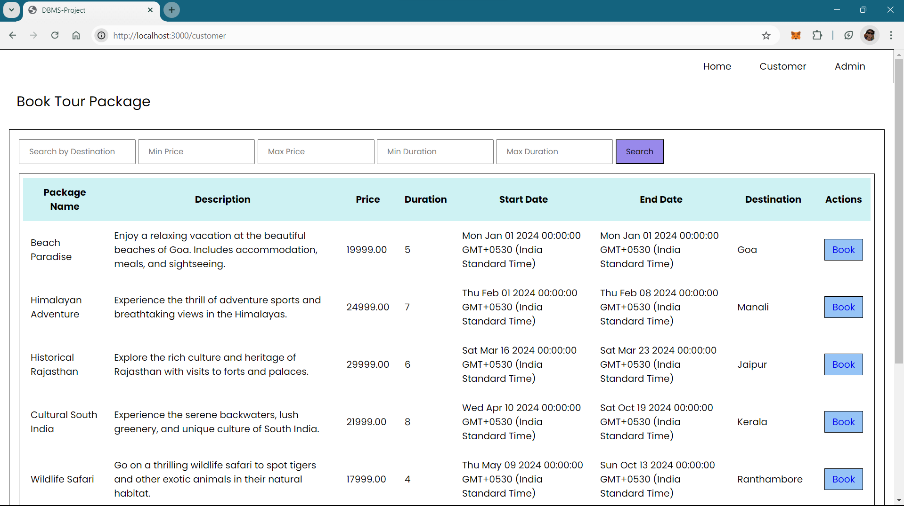
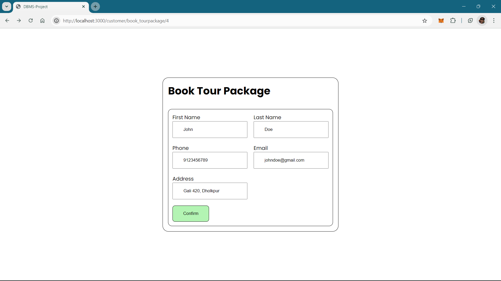
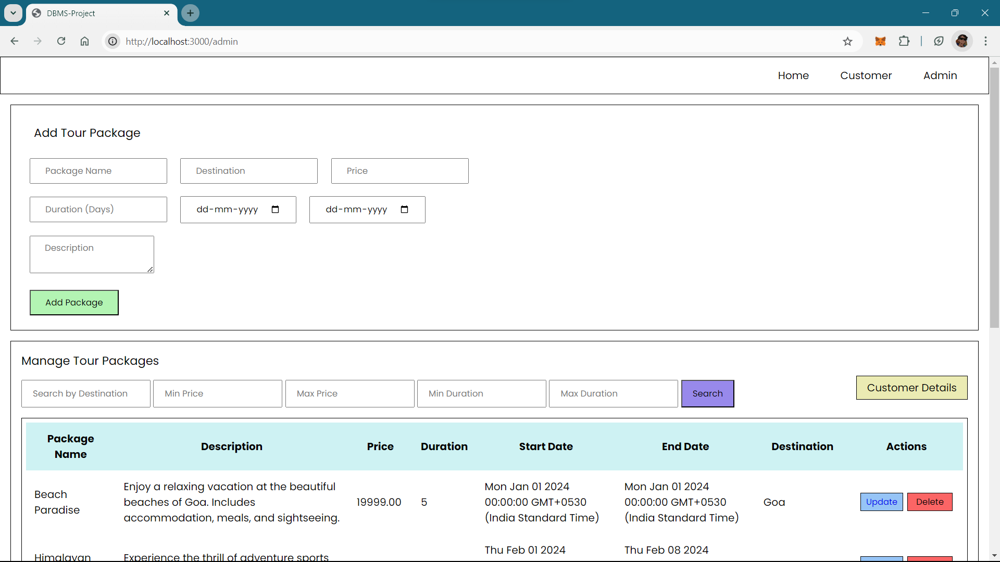
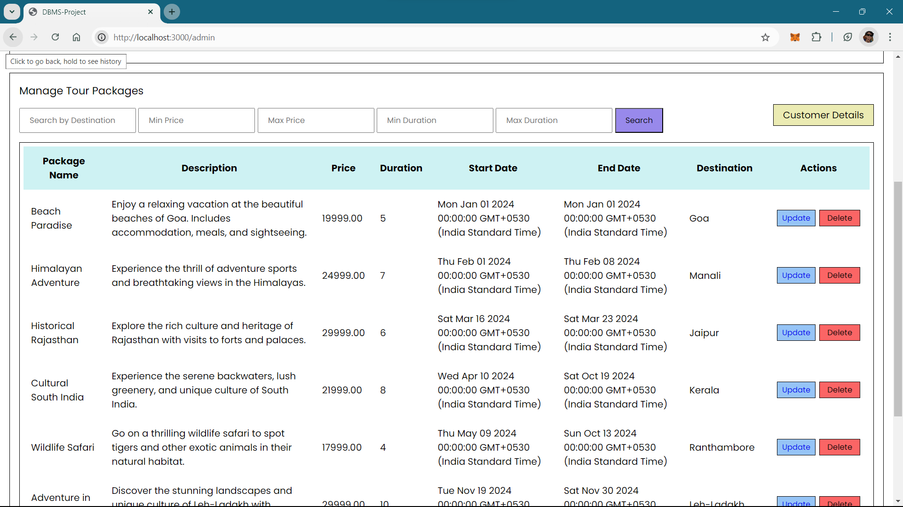

# Tour Package Management System

This project is a **Tour Package Management System** built using **Node.js**, **Express**, **Ejs** and **MySQL**. It allows customers to browse and book tour packages, while administrators can manage packages, view customer bookings, and update/delete packages.

## Features

### Customer:
- Browse available tour packages.
- Book a tour package.
- View booking confirmation.

### Admin:
- Add, update, and delete tour packages.
- View all customer bookings.
- Search and filter tour packages

## Installation

### Prerequisites
- Node.js and npm installed
- MySQL installed
- Git (for version control)
## Tech Stack

- Frontend: HTML, CSS, JavaScript
- Backend: Node.js, Express
- Database: MySQL
- View Engine: EJS (Embedded JavaScript)
- Other: dotenv for environment variables


## Run Locally

Clone the project

```bash
  git clone https://github.com/N1nadLad/Tour_Package_Management_System
```

Go to the project directory

```bash
  cd Tour_Package_Management_System
```

Install dependencies

```bash
  npm install
```

Start the server

```bash
  node app.js
```


## Database Schema

- Customers:
    - customer_id (Primary Key)
    - first_name
    - last_name
    - email

 - TourPackages:
    - package_id (Primary Key)
    - package_name
    - description
    - destination
    - price
    - duration
    - start_date
    - end_date

 - Bookings:
    - booking_id (Primary Key)
    - customer_id (Foreign Key references Customers.customer_id)
    - package_id (Foreign Key references TourPackages.package_id)
    - booking_date
## Environment Variables

To run this project, you will need to add the following environment variables to your .env file

`MYSQL_HOST = 'localhost'`

`MYSQL_USER = 'your_username_here'`

`MYSQL_PASSWORD = 'your_password_here'`

`MYSQL_DATABASE = 'your_dbname_here'`

`PORT = your_portNum_here`
## Screenshots

  ### Home Screen
   
  ### Customer Page
   
   
  ### Admin Page
  
   

## Authors

- [@N1nadLad](https://github.com/N1nadLad)

